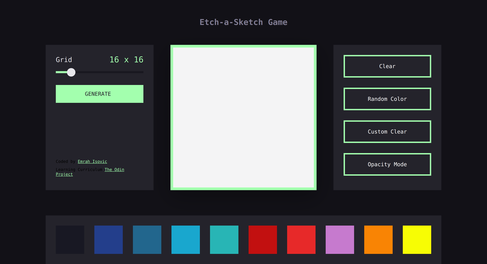

# Etch-a-Sketch
Another project from The Odin Project lecture for learning and practicing DOM manipulation skills.

## Table of concepts
- [Overview](#overview)
  - [Screenshot](#screenshot)
  - [Links](#links)
- [Built with](#built-with)
- [Author](#author)

## Overview

### Screenshot

### Links
  - Live preview - [Etch-a-Sketch] (https://emrahiso.github.io/Etch-1-Sketch/)
  - GitHub repo - (https://github.com/EmrahIso/Etch-1-Sketch.git)

## Built with 
  - JavaScript
  - CSS Grid
  - FlexBox
  - CSS Transforms
  - CSS Transitions
  - JS DOM Manipulation
  
## Author

- GitHub - [@EmrahIso](https://github.com/EmrahIso)